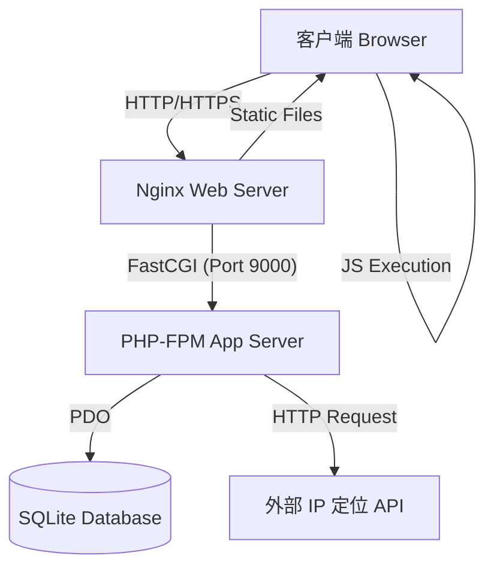

# Speed Probe 系统架构文档

## 1. 简介
Speed Probe 是一个伪装成网络测速工具的高级访客信息采集系统。本系统旨在通过友好的前端交互（模拟测速）收集访客的详细设备指纹、网络环境及地理位置信息，并提供一个现代化的后台管理界面进行数据分析。

## 2. 系统架构概览

本系统采用基于 Docker 的容器化微服务架构，主要包含以下组件：

*   **接入层 (Nginx)**: 负责静态资源服务、反向代理及 PHP-FPM 请求转发。
*   **应用层 (PHP-FPM)**: 处理业务逻辑，包括数据采集 API 和管理后台逻辑。
*   **数据层 (SQLite)**: 轻量级文件数据库，存储访客记录。
*   **客户端 (Browser)**: 执行采集脚本 (`collector.js`) 和渲染测速动画。

### 架构图 (Mermaid)



## 3. 技术栈

| 组件 | 技术选型 | 版本 | 说明 |
| :--- | :--- | :--- | :--- |
| **前端** | Tailwind CSS | 3.x (CDN) | UI 样式框架 |
| | Vue.js | 3.x (CDN) | 管理后台交互逻辑 |
| | Vanilla JS | ES6+ | 核心采集与测速脚本 |
| **后端** | PHP | 8.2-fpm-alpine | 业务逻辑处理 |
| **数据库** | SQLite | 3 | 单文件数据库，免配置 |
| **Web服务器** | Nginx | latest | 反向代理与静态服务 |
| **部署** | Docker Compose | 3.8+ | 容器编排 |

## 4. 目录结构设计

```text
/speed-probe
├── docker-compose.yml       # 容器编排配置
├── nginx/                   # Nginx 配置目录
├── backend/                 # 后端应用目录
│   ├── Dockerfile           # PHP 镜像构建文件
│   └── public/              # Web 根目录
│       ├── index.php        # 前台入口
│       ├── admin.php        # 后台入口
│       ├── api.php          # API 接口
│       ├── db.php           # 数据库连接层
│       ├── data/            # 数据库文件存储
│       └── js/              # 静态 JS 资源
└── docs/                    # 项目文档
```

## 5. 数据流向

1.  **访问阶段**: 用户访问 `index.php`，Nginx 返回页面及 `collector.js`。
2.  **采集阶段**: 
    *   `collector.js` 在浏览器端收集设备指纹、WebGL信息、网络状态。
    *   通过 POST 请求发送至 `/api.php?action=collect`。
3.  **处理阶段**:
    *   API 接收数据，获取客户端真实 IP。
    *   API 调用服务端定位接口（如 `ip-api.com`）获取地理位置。
    *   数据写入 SQLite 数据库。
4.  **管理阶段**: 管理员访问 `admin.php`，Vue.js 调用 API 获取数据并渲染。

## 6. 安全设计

*   **数据隔离**: 数据库文件位于 `/data` 目录，通过 Nginx 配置禁止直接访问 `.db` 文件（需配置）。
*   **输入过滤**: `api.php` 对所有输入数据进行预处理，防止 XSS 和 SQL 注入（使用 PDO 预处理语句）。
*   **权限控制**: 建议在生产环境 Nginx 层添加 HTTP Basic Auth 保护 `/admin.php`。
