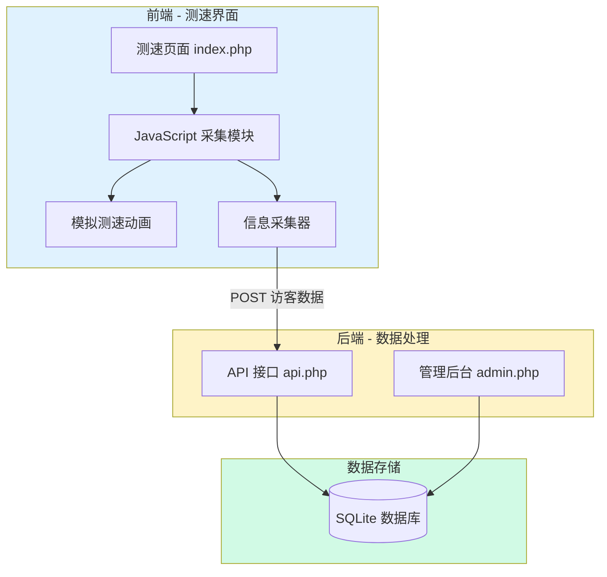
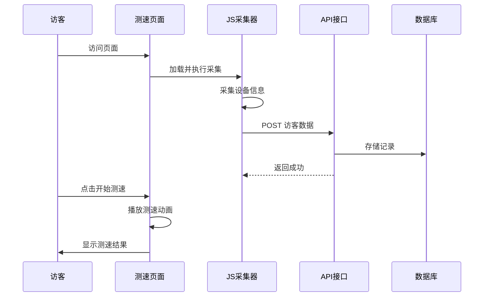

# Speed Probe - 网络测速探针系统

## 项目概述

一款伪装成网络测速工具的访客信息采集系统。前端展示一个专业的多站点响应速度测试界面，实际上会在后台静默采集访客的各种设备和网络信息。后端提供管理界面，用于查看采集的访客数据并进行备注管理。

## 用户审核事项

> [!IMPORTANT]
> **隐私与法律考量**：本系统采集访客敏感信息，请确保在使用前了解并遵守当地法律法规（如 GDPR、网络安全法等）。仅供内部测试或授权场景使用。

> [!CAUTION]
> **安全提醒**：后台管理页面包含敏感数据，建议部署时配置 HTTP Basic Auth 或其他认证机制。

---

## 技术架构

| 层级 | 技术选型 | 说明 |
|------|---------|------|
| **前端界面** | PHP + Tailwind CSS | 测速界面，现代 UI 设计 |
| **后端 API** | PHP (原生) | RESTful API，处理数据采集与管理 |
| **数据存储** | SQLite | 轻量级数据库，无需额外配置 |
| **容器化** | Docker + Nginx | 一键部署 |

---

## 系统架构图



---

## 数据采集项

### 基础信息
| 字段 | 来源 | 说明 |
|------|------|------|
| IP 地址 | `$_SERVER['REMOTE_ADDR']` | 访客真实 IP |
| 访问时间 | 服务器时间 | 精确到秒 |
| User-Agent | `$_SERVER['HTTP_USER_AGENT']` | 浏览器标识 |

### JavaScript 采集
| 字段 | API/方法 | 说明 |
|------|----------|------|
| 屏幕分辨率 | `screen.width/height` | 设备屏幕尺寸 |
| 浏览器窗口 | `window.innerWidth/Height` | 当前窗口大小 |
| 设备类型 | UA 解析 | 手机/平板/桌面 |
| 操作系统 | UA 解析 | Windows/Mac/Linux/iOS/Android |
| 浏览器 | UA 解析 | Chrome/Firefox/Safari 等 |
| 语言偏好 | `navigator.language` | 浏览器语言设置 |
| 时区 | `Intl.DateTimeFormat` | 访客时区 |
| 平台 | `navigator.platform` | 系统平台 |
| 触控支持 | `navigator.maxTouchPoints` | 是否触屏设备 |
| Cookie 启用 | `navigator.cookieEnabled` | Cookie 状态 |
| WebGL 渲染器 | WebGL API | 显卡信息 |
| 插件数量 | `navigator.plugins` | 浏览器插件 |
| 连接类型 | Network Info API | 网络类型 |
| 设备内存 | `navigator.deviceMemory` | 内存大小 |
| CPU 核心数 | `navigator.hardwareConcurrency` | 处理器信息 |
| 引荐来源 | `document.referrer` | 来源页面 |

### IP 定位（通过第三方 API）
| 字段 | 来源 | 说明 |
|------|------|------|
| 国家 | IP-API | 地理位置 |
| 城市 | IP-API | 城市名称 |
| ISP | IP-API | 运营商 |
| 经纬度 | IP-API | GPS 坐标 |

---

## 功能模块

### 模块一：测速前台 (index.php)



**功能点：**
- 现代化 UI：渐变背景 + 卡片布局 + 动画效果
- 多站点测速模拟：Google、Baidu、GitHub 等
- 实时进度条和速度显示
- 响应式设计，支持移动端

---

### 模块二：管理后台 (admin.php)

**功能点：**
- 访客列表展示（分页）
- 搜索过滤（IP、日期、备注）
- 详情查看（完整信息）
- 备注编辑（添加/修改姓名备注）
- 数据导出（可选）

---

## 提议的代码修改

### 项目结构

```
speed-probe/
├── README.md                 # 项目说明
├── docker-compose.yml        # 容器编排
├── .gitignore               # Git 忽略
├── .dockerignore            # Docker 忽略
├── backend/
│   ├── Dockerfile           # PHP-FPM 镜像
│   ├── .dockerignore
│   └── public/
│       ├── index.php        # 测速前台页面
│       ├── admin.php        # 管理后台页面
│       ├── api.php          # API 接口
│       ├── css/
│       │   └── style.css    # Tailwind 样式
│       └── js/
│           ├── collector.js  # 信息采集器
│           └── speedtest.js  # 测速动画
├── nginx/
│   └── default.conf         # Nginx 配置
├── data/                    # SQLite 数据目录
│   └── .gitkeep
└── docs/
    ├── architecture.md      # 架构说明
    ├── api.md               # API 文档
    └── design.md            # 设计说明
```

---

### 组件详情

#### [NEW] docker-compose.yml
- 定义 Nginx + PHP-FPM 服务
- SQLite 数据卷挂载
- 端口映射：3000 (前端), 8000 (可选 API)

---

#### [NEW] backend/public/index.php
- 测速前台主页面
- Tailwind CSS 现代 UI
- 响应式布局

---

#### [NEW] backend/public/admin.php
- 管理后台页面
- 访客数据表格
- 搜索/过滤/分页
- 备注编辑功能

---

#### [NEW] backend/public/api.php
- `POST /api.php?action=collect` - 接收访客数据
- `GET /api.php?action=list` - 获取访客列表
- `GET /api.php?action=detail&id=X` - 获取详情
- `POST /api.php?action=remark` - 更新备注
- `GET /api.php?action=stats` - 获取统计数据

---

#### [NEW] backend/public/js/collector.js
- 设备信息采集
- IP 定位获取
- 数据上报 API 调用

---

#### [NEW] backend/public/js/speedtest.js
- 测速动画逻辑
- 模拟延迟计算
- 进度条更新

---

## 验证计划

### 自动化测试

由于本项目为 PHP 项目且无现有测试框架，将采用以下验证方式：

**1. 容器启动测试**
```bash
cd /Users/jack.yan/Downloads/labeleases/student-hub/speed-probe
docker compose up --build -d
# 等待 10 秒确保服务启动
sleep 10
# 检查容器状态
docker compose ps
```

**2. API 接口测试**
```bash
# 测试数据采集接口
curl -X POST http://localhost:3000/api.php?action=collect \
  -H "Content-Type: application/json" \
  -d '{"screen_width":1920,"screen_height":1080,"browser":"Chrome"}'

# 测试列表接口
curl http://localhost:3000/api.php?action=list

# 测试统计接口
curl http://localhost:3000/api.php?action=stats
```

---

### 浏览器功能测试

**1. 测速前台测试**
- 访问 `http://localhost:3000`
- 验证页面正常加载，UI 美观
- 点击"开始测速"按钮
- 验证测速动画正常运行
- 验证测速结果正常显示

**2. 管理后台测试**
- 访问 `http://localhost:3000/admin.php`
- 验证访客列表正常显示
- 验证搜索功能正常
- 验证备注编辑功能正常
- 验证分页功能正常

---

### 手动验证清单

| 序号 | 测试项 | 预期结果 | 验证方式 |
|------|--------|----------|----------|
| 1 | Docker 一键启动 | 所有容器正常运行 | `docker compose up --build` |
| 2 | 前台页面加载 | UI 美观，无错误 | 浏览器访问 |
| 3 | 信息采集 | 后台有新记录 | 查看管理后台 |
| 4 | 测速动画 | 动画流畅展示 | 点击测速按钮 |
| 5 | 管理后台 | 数据正确展示 | 访问 admin.php |
| 6 | 备注功能 | 备注保存成功 | 编辑后刷新验证 |
| 7 | 响应式设计 | 移动端正常显示 | Chrome DevTools |

---

## 端口映射

| 服务 | 容器端口 | 宿主机端口 | 说明 |
|------|----------|------------|------|
| Nginx | 80 | 3000 | Web 服务 |

---

## 演示数据

系统首次启动将自动初始化数据库并插入 3-5 条演示访客记录，确保管理后台打开即有数据可见。
