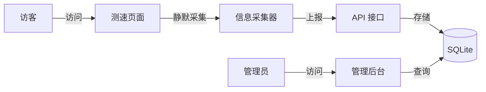
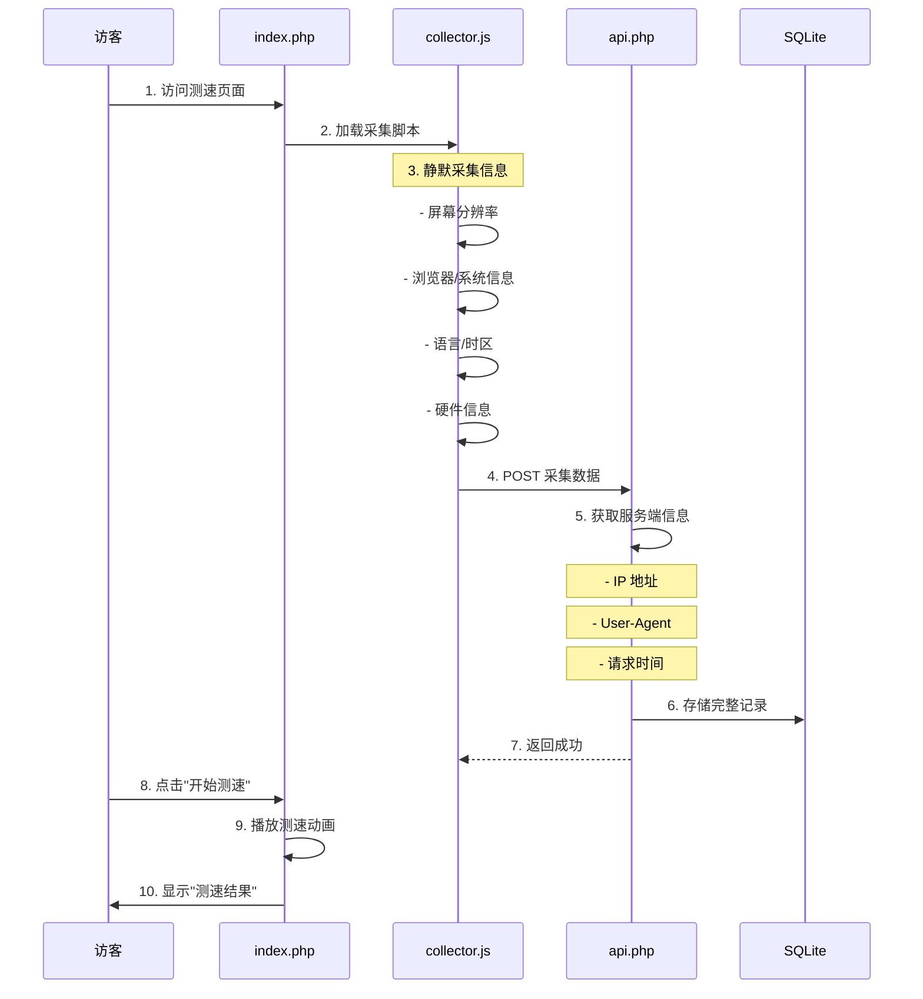
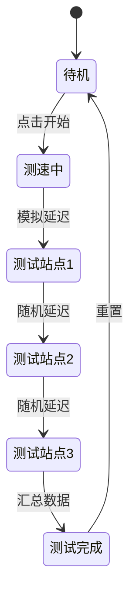
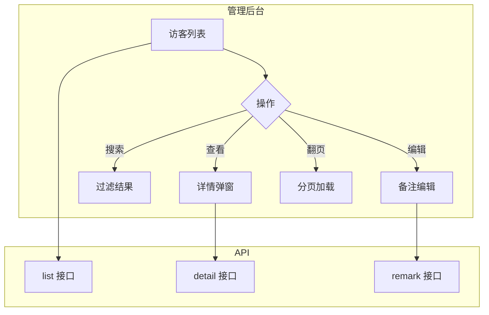

# Speed Probe 逻辑梳理

## 系统概述

**Speed Probe** 是一个伪装成网络测速工具的访客信息采集系统。



---

## 核心逻辑流程

### 1. 访客访问流程



---

### 2. 信息采集详解

#### 客户端采集 (JavaScript)

```javascript
// 采集器核心逻辑
const collectedData = {
    // 屏幕信息
    screen_width: screen.width,
    screen_height: screen.height,
    window_width: window.innerWidth,
    window_height: window.innerHeight,
    
    // 浏览器信息
    user_agent: navigator.userAgent,
    language: navigator.language,
    platform: navigator.platform,
    cookie_enabled: navigator.cookieEnabled,
    
    // 硬件信息
    device_memory: navigator.deviceMemory,
    cpu_cores: navigator.hardwareConcurrency,
    touch_points: navigator.maxTouchPoints,
    
    // 网络信息
    connection_type: navigator.connection?.effectiveType,
    
    // 时区
    timezone: Intl.DateTimeFormat().resolvedOptions().timeZone,
    
    // 来源
    referrer: document.referrer
};
```

#### 服务端采集 (PHP)

```php
// 服务端补充信息
$serverData = [
    'ip' => $_SERVER['REMOTE_ADDR'],
    'user_agent' => $_SERVER['HTTP_USER_AGENT'],
    'accept_language' => $_SERVER['HTTP_ACCEPT_LANGUAGE'],
    'timestamp' => date('Y-m-d H:i:s')
];
```

---

### 3. 测速动画逻辑

测速界面展示专业的测速动画，但实际上只是模拟效果：



**模拟逻辑：**
- 每个站点测试 1-3 秒
- 延迟值在合理范围内随机生成
- 进度条按站点数量递增
- 最终显示"平均延迟"和"网络评级"

---

### 4. 管理后台逻辑



---

## 数据库设计

### visitors 表

| 字段 | 类型 | 说明 |
|------|------|------|
| id | INTEGER | 主键，自增 |
| ip | TEXT | IP 地址 |
| country | TEXT | 国家 |
| city | TEXT | 城市 |
| isp | TEXT | 运营商 |
| user_agent | TEXT | 浏览器标识 |
| browser | TEXT | 浏览器名称 |
| browser_version | TEXT | 浏览器版本 |
| os | TEXT | 操作系统 |
| os_version | TEXT | 系统版本 |
| device_type | TEXT | 设备类型 |
| screen_width | INTEGER | 屏幕宽度 |
| screen_height | INTEGER | 屏幕高度 |
| window_width | INTEGER | 窗口宽度 |
| window_height | INTEGER | 窗口高度 |
| language | TEXT | 语言偏好 |
| timezone | TEXT | 时区 |
| platform | TEXT | 平台 |
| cookie_enabled | INTEGER | Cookie 状态 |
| touch_points | INTEGER | 触控点数 |
| device_memory | REAL | 设备内存 |
| cpu_cores | INTEGER | CPU 核心数 |
| connection_type | TEXT | 网络类型 |
| referrer | TEXT | 来源页面 |
| remark | TEXT | 备注 |
| created_at | DATETIME | 创建时间 |

---

## 安全考量

1. **SQL 注入防护**：使用 PDO 预处理语句
2. **XSS 防护**：输出时转义 HTML
3. **CSRF 防护**：API 请求验证（可选）
4. **访问控制**：后台可配置密码保护

---

## 技术要点

### 1. IP 定位
使用免费的 IP-API 服务获取地理位置：
```javascript
fetch('http://ip-api.com/json/')
  .then(response => response.json())
  .then(data => {
    // 获取国家、城市、ISP 等信息
  });
```

### 2. WebGL 指纹
通过 WebGL 获取显卡信息作为设备指纹：
```javascript
const canvas = document.createElement('canvas');
const gl = canvas.getContext('webgl');
const debugInfo = gl.getExtension('WEBGL_debug_renderer_info');
const renderer = gl.getParameter(debugInfo.UNMASKED_RENDERER_WEBGL);
```

### 3. 响应式设计
使用 Tailwind CSS 的响应式类实现适配：
```html
<div class="grid grid-cols-1 md:grid-cols-2 lg:grid-cols-3">
  <!-- 自动适配不同屏幕 -->
</div>
```

---

## 预期效果

### 前台界面
- 现代渐变背景
- 专业的测速仪表盘
- 流畅的动画效果
- 清晰的结果展示

### 后台界面
- 数据表格清晰
- 操作按钮明显
- 搜索过滤便捷
- 详情信息完整
